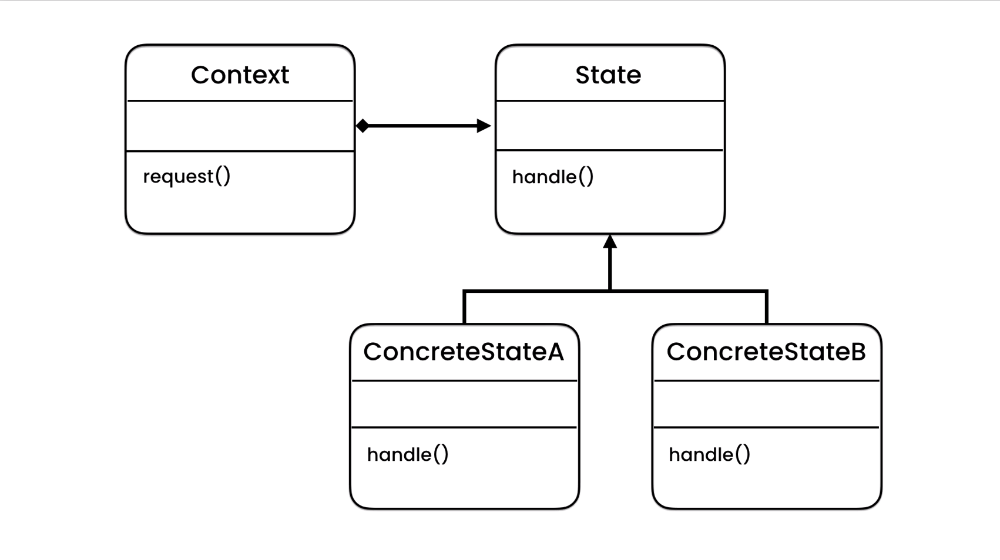

# Coding With Mosh Design Patterns

## Momento Pattern
 The Memento Pattern is a behavioral design pattern that allows an object to save its state and to restore it later. This pattern is useful for implementing undo mechanisms. It involves three main components: the Originator (the object whose state needs to be saved), the Memento (the object that stores the state), and the Caretaker (the object that requests the save and restore operations).
 

 ## State Pattern
 The State Pattern is a behavioral design pattern that allows an object to change its behavior when its internal state changes. This pattern encapsulates state-specific behavior into separate state objects and delegates state-specific behavior to the current state object. It involves three main components: the Context (the object whose behavior varies based on its state), the State (an interface or abstract class defining the behavior associated with a particular state), and Concrete States (classes that implement the State interface and define specific behaviors for each state).
  